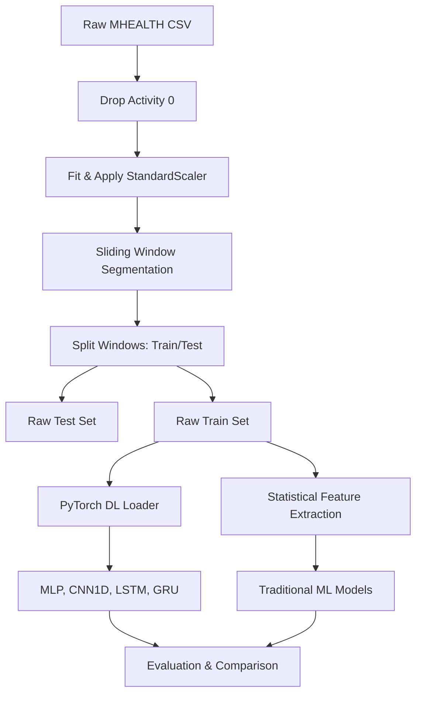

# Methodology

This project employs a systematic, modular pipeline designed to clean, segment, analyze, and classify human activity sensor data. The workflow scales from raw continuous time-series records to trained Machine Learning and PyTorch Deep Learning classifiers.

---

## 🧹 1. Preprocessing

The preprocessing pipeline filters and normalizes the continuous sensor stream:
- **Null Activity Filtering**: Row indexes where `Activity == 0` (idle transitions) are removed because they do not represent one of the 12 target activities.
- **Normalization**: Inertial signals vary in units and magnitude (e.g., accelerometer $g$ vs. gyroscope $\text{deg/sec}$). We apply a `StandardScaler` fitted on the training split to bring all features to $\mu=0, \sigma=1$.
- **Scaler Persistence**: The fitted scaler is saved to `checkpoints/scaler.joblib` for consistency during inference.

---

## ⚙️ 2. Feature Engineering

Physical activities are time-dependent; a single sample point (1/50th of a second) is insufficient for context. We use a **Sliding Window** approach:
- **Window Size**: 128 samples (~2.56 seconds at 50 Hz).
- **Overlap/Step**: 64 samples (50% overlap).
- **Subject-Aware Grouping**: To prevent data leakage, we group by `subject` (since volunteers perform actions continuously). Windows do not cross subject boundaries.

For traditional ML classifiers, we extract **8 statistical features** from each of the 12 sensor channels, reducing each $128 \times 12$ window to a $96$-dimensional feature vector:
1. **Mean**: Average signal value.
2. **Standard Deviation**: Signal dispersion.
3. **Minimum**: Lowest value.
4. **Maximum**: Highest value.
5. **Median**: Middle value.
6. **Variance**: Spread of the data.
7. **Root Mean Square (RMS)**: Quadratic mean indicating signal energy.
8. **Peak-to-Peak (PTP)**: Difference between max and min.

---

## 🤖 3. Model Zoo

We evaluate two distinct families of classifiers:

### Traditional Machine Learning (tabular features)
1. **Logistic Regression**: Linear baseline with dynamic parameter filtering.
2. **Decision Tree**: Non-linear, interpretable baseline.
3. **Random Forest**: Ensemble of trees using bagging.
4. **Support Vector Machine (SVM)**: Max-margin classifier with automatic sample limits.
5. **XGBoost**: Gradient boosted trees optimized by gain.
6. **LightGBM**: Leaf-wise gradient boosted trees optimized for speed.
7. **CatBoost**: Category-optimized gradient boosting.

### PyTorch Deep Learning (raw sequential windows)
1. **Multi-Layer Perceptron (MLP)**: Fully connected feed-forward network ($96 \rightarrow 256 \rightarrow 128 \rightarrow 64 \rightarrow 12$).
2. **1D CNN (CNN1D)**: Temporal convolutional network using 1D filters to extract spatial-temporal features directly, followed by Adaptive Average Pooling to handle variable window sizes.
3. **LSTM**: Recurrent neural network capturing long-term dependencies.
4. **GRU**: Gated recurrent neural network with a simplified gating architecture.

---

## 📈 4. Evaluation Suite

Evaluation metrics are designed to assess class balance and classification accuracy:
- **Classification Report**: Computes class-specific accuracy, precision, recall, and F1-scores.
- **Normalized Confusion Matrix**: Heatmap visualization indicating error patterns and class confusion.
- **Receiver Operating Characteristic (ROC) & AUC**: One-vs-Rest ROC curve plotting false positive vs. true positive rates across thresholds.
- **Feature Importance Analysis**: Extracts tree feature importances or linear coefficients to identify which body location (e.g., right wrist or left ankle) is most informative.
