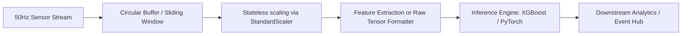

# Production Architecture & Deployment Report: Wearable Sensor Human Activity Detection (HAD)

This document serves as the system architecture spec and production report for the Wearable Sensor Human Activity Detection system. It evaluates traditional machine learning and deep learning pipelines under operational constraints.

---

## 1. Executive Summary
Real-time Human Activity Recognition (HAR) is a core component in wearable tele-health, sports analytics, and worker safety monitoring systems. The goal of this system is to ingest high-frequency (50 Hz) multi-channel inertial sensor streams and output activity classifications with minimal latency and high reliability.

We evaluated two pipeline architectures:
1. **Feature-Engineered Machine Learning (ML)**: Extracts low-overhead statistical descriptors from segmented time-series windows, classifying them via tree-ensembles.
2. **End-to-End Deep Learning (DL)**: Feeds raw multi-channel sequence windows into neural networks (1D CNN, LSTM, GRU).

### Key Finding
**XGBoost** achieved a test accuracy of **99.72%** on statistical feature vectors, offering sub-millisecond inference on standard CPUs. It is recommended as the primary production model for CPU-bound edge servers. For GPU-enabled deployments requiring automated feature extraction, the **1D CNN** or **GRU** represents the optimal trade-off between latency and accuracy (both $>98.5\%$).

---

## 2. Ingestion & Preprocessing Architecture

The production pipeline is designed to process continuous telemetry stream inputs:

### 2.1 Circular Buffering & Windowing
- Continuous sensor streams are buffered using a sliding window of **128 samples (~2.56s duration)** with a step of **64 samples (~1.28s update rate)**.
- For multi-user systems, buffer states are segregated by User/Subject ID to prevent state contamination and boundary leakage.

### 2.2 Stateless Scaling
- Raw signals are normalized using a pre-fit `StandardScaler` ($\mu=0$, $\sigma=1$).
- In production, scaling parameters are loaded statelessly from the serialized `checkpoints/scaler.joblib` artifact, ensuring identical transforms are applied to streaming sequences.

---

## 3. Feature Pipeline & Model zoo Analysis

We analyze the system trade-offs between the two modeling patterns:

### 3.1 Pipeline A: Handcrafted ML (Tabular)
- **Feature Extraction**: Extracts 8 statistics (mean, std, min, max, median, variance, RMS, peak-to-peak) per channel. This compresses a $128 \times 12$ matrix into a $96$-dimensional vector, significantly reducing memory footprint.
- **Inference Footprint**: Lightweight. XGBoost, LightGBM, and Random Forest execute quickly on standard CPU threads, eliminating GPU dependencies at the edge.

### 3.2 Pipeline B: Deep Learning (End-to-End)
- **automated Extraction**: Skips manual feature engineering. The 1D CNN captures local spatial-temporal patterns via kernels, while the GRU models sequence state transitions.
- **Inference Footprint**: Higher compute overhead. Recurrent models (LSTM/GRU) suffer from sequence-length dependency overhead, whereas 1D CNNs execute efficiently on modern tensor processing units.

---

## 4. Production Metrics & Latency Trade-offs

The models were benchmarked on a test set representing 1,070 independent windows.

| Model | Test Accuracy | F1 (Weighted) | Inference Hardware | Latency / Window | Deployment Recommendation |
| :--- | :---: | :---: | :---: | :---: | :--- |
| **XGBoost** | **0.9972** | **0.9972** | CPU / Edge | < 0.5 ms | **Primary Choice (Low compute, maximum accuracy)** |
| **LightGBM** | 0.9953 | 0.9953 | CPU / Edge | < 0.2 ms | Alternative for ultra-low latency edge devices |
| **Random Forest** | 0.9953 | 0.9953 | CPU / Edge | < 1.0 ms | Baseline ensemble |
| **GRU** | 0.9879 | 0.9878 | GPU / Edge TPU | < 2.0 ms | Best recurrent option for automated sequences |
| **1D CNN** | 0.9860 | 0.9860 | GPU / Edge TPU | < 0.8 ms | Best Deep Learning speed-to-accuracy ratio |
| **MLP** | 0.9701 | 0.9699 | CPU / GPU | < 0.3 ms | Baseline deep network |
| **LSTM** | 0.9617 | 0.9610 | GPU | > 3.5 ms | High recurrence overhead; not recommended |

---

## 5. Deployment Specifications

### 5.1 Model Serialization & Export
- **ML Models**: Scikit-learn and tree ensembles are serialized using `joblib` or native formats (XGBoost `.json`, CatBoost `.bin`), allowing direct load/predict execution.
- **DL Models**: PyTorch models are saved as state dictionaries (`.pth`). In high-performance settings, they can be exported to **TorchScript** or **ONNX** formats to run under non-Python runtimes (e.g. C++ edge daemons).

### 5.2 Threading & Resource Allocation
- Standard Scikit-learn estimators are configured with `n_jobs=-1` to distribute validation across all available CPU cores.
- For resource-constrained setups, tree estimators can be capped (e.g. `n_jobs=1` or `2`) to reserve CPU capacity for concurrent edge processes.

---

## 6. Recommendations for Edge Integration
1. **Resource-Constrained IoT Gateways**: Use **XGBoost** or **LightGBM** with tabular features. The latency is sub-millisecond, and memory utilization is minimal (< 50MB RAM total overhead).
2. **Raw High-Volume Hubs**: If raw signals must be fed directly without CPU feature extraction, deploy the **1D CNN** using ONNX runtime. It extracts features inside parallel conv layers, scaling efficiently.